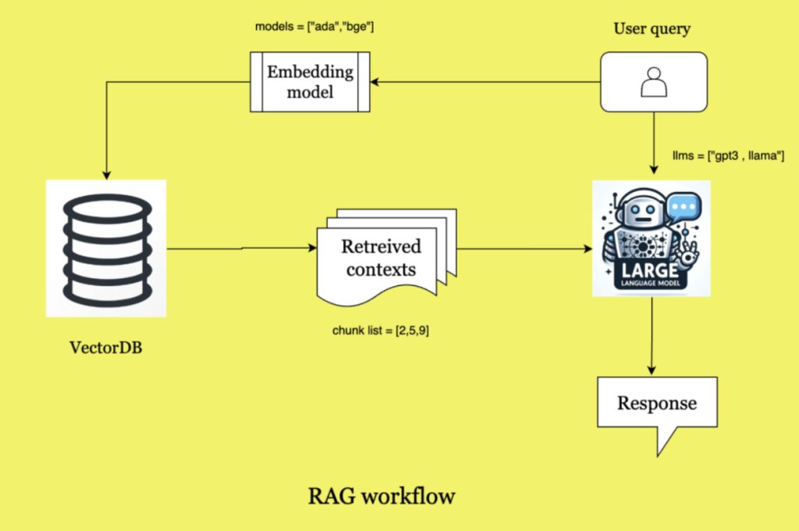

# 📄 Chat with PDFs using Gemini (RAG Application)

A production-grade **Retrieval-Augmented Generation (RAG)** application that allows users to upload PDFs and ask questions grounded strictly in document content, powered by **Gemini 2.5 Flash** and **FAISS vector search**.

---

## 🚀 Overview

This application enables users to:

- Upload one or more **PDF documents**
- Ask **natural-language questions**
- Receive **accurate, context-aware answers**
- View the **exact source text** used for answering
- Interact through a **chat-style UI** with dark-mode support

✅ No hallucinations  
✅ No guessing  
✅ Answers strictly from uploaded documents

---

## 🧠 Why Retrieval-Augmented Generation (RAG)?

Large Language Models (LLMs) are powerful, but they **cannot reliably answer questions from private or domain-specific documents**.

This project solves that problem using **RAG**, which combines:

- Semantic search over documents
- Local vector embeddings
- LLM reasoning constrained by retrieved context

---

## 🏗️ System Architecture



> This diagram illustrates how document retrieval and LLM reasoning are decoupled to ensure accuracy, scalability, and cost efficiency.

---
## 🧩 Tech Stack & Design Choices

| Component | Tool | Reason |
|--------|------|-------|
| UI | Streamlit | Rapid, interactive app development |
| PDF Parsing | PyPDF2 | Lightweight and reliable |
| Embeddings | HuggingFace | Local, free, no API quotas |
| Vector DB | FAISS | High-performance similarity search |
| LLM | Gemini 2.5 Flash | Fast, stable, large context window |
| SDK | google-genai | Official, future-proof Gemini integration |

---

## ⚙️ Key Engineering Decisions

- Used **local embeddings** to avoid API quota and billing issues
- Decoupled **retrieval** from **generation**
- Avoided deprecated LangChain Gemini wrappers
- Dynamically discovered supported Gemini models using `client.models.list()`
- Designed with **vendor flexibility** in mind

---

## 🖥️ Features

- 💬 Chat-style interface (question left, answer right)
- 🌙 Dark-mode friendly UI
- ⏳ Loading animation while Gemini responds
- 📄 Collapsible source-text panel
- 🔒 Strict context grounding (no hallucinations)


---

## 🔐 Environment Setup

### 1️⃣ Create `.env`

```env
GOOGLE_API_KEY=your_gemini_api_key_here


## 🛠️ Setup & Usage

### 2️⃣ Install Dependencies

```bash
pip install -r requirements.txt
streamlit run app.py


## 🧪 Example Questions to Try

You can ask questions such as:

- **What are the working hours mentioned in the document?**
- **Is remote work allowed?**
- **What is the notice period?**
- **Summarize the employee policy.**

If the answer is **not present in the uploaded PDFs**, the system responds with:

> **"Answer is not available in the context."**

This ensures the model does **not hallucinate or guess** and answers strictly from the provided documents.
